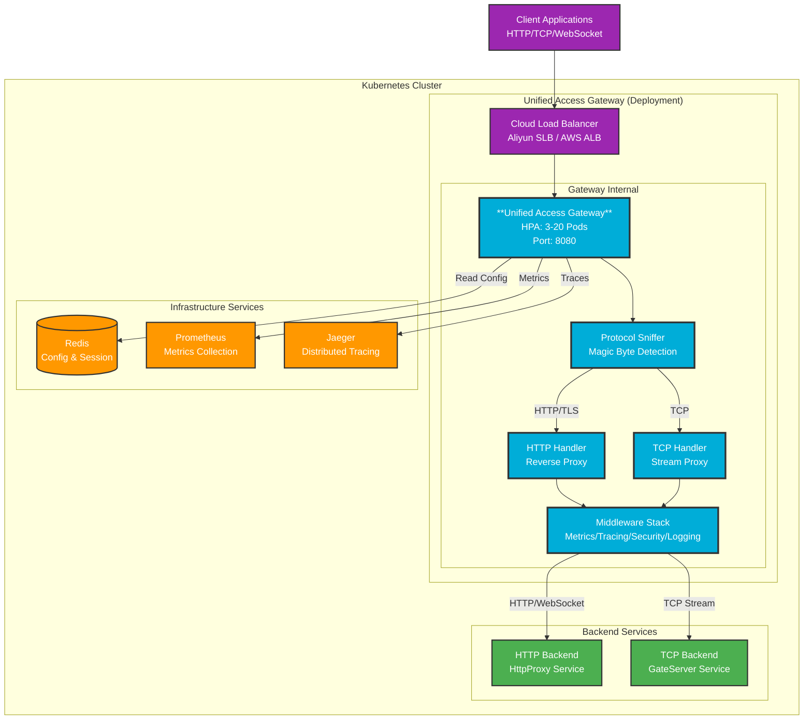
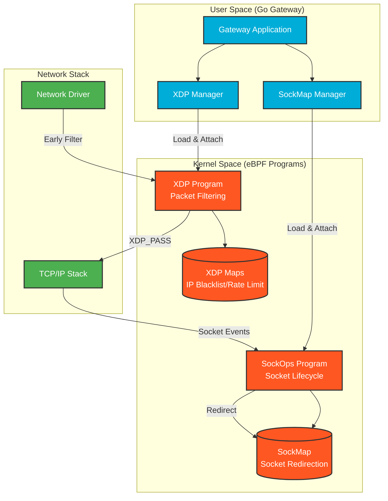
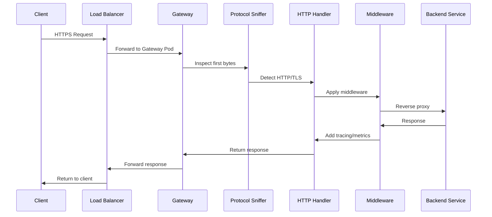
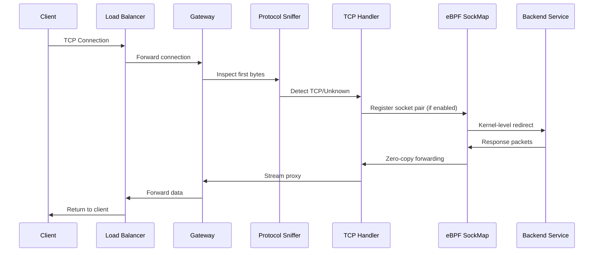
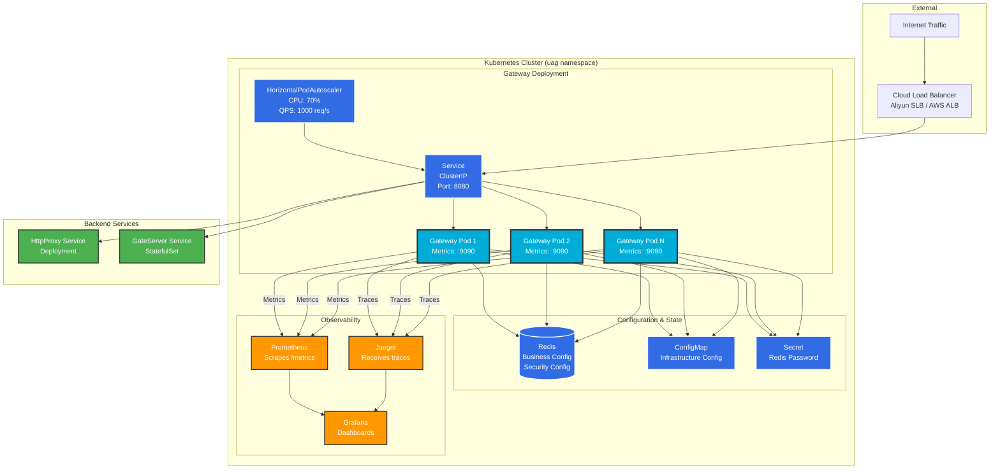

# Architecture

## Overview

Unified Access Gateway is a cloud-native, multi-protocol gateway designed for high-performance microservices architectures. It provides a single entry point for HTTP, TCP, and WebSocket traffic with automatic protocol detection.

## System Architecture

## Core Components

### 1. Protocol Sniffer

Automatically detects protocol type by inspecting the first few bytes of incoming connections:

- **HTTP**: Detects `GET`, `POST`, `PUT`, `DELETE`, etc.
- **TLS/HTTPS**: Detects TLS handshake (`0x16`)
- **TCP**: Default fallback for unrecognized protocols

### 2. HTTP Handler

- Reverse proxy using `httputil.ReverseProxy`
- Supports HTTP/1.1 and HTTP/2
- WebSocket upgrade support
- Request/response metrics collection

### 3. TCP Handler

- Stream proxy using `io.Copy`
- eBPF SockMap acceleration (optional)
- Connection metrics
- Graceful connection draining

### 4. Middleware Stack

- **Metrics**: Prometheus metrics collection
- **Tracing**: OpenTelemetry distributed tracing
- **Security**: Rate limiting, WAF, authentication
- **Logging**: Structured access logs

## Cloud-Native Features

### 1. Configuration Management

- **Business Config**: Loaded from Redis (read-only)
- **Infrastructure Config**: Environment variables / ConfigMap
- **Hot Reload**: Redis pub/sub for dynamic updates

### 2. Service Discovery

- Kubernetes DNS resolution
- Automatic backend discovery
- Health-aware routing

### 3. Health Probes

- **Liveness**: `/health` - Process health check
- **Readiness**: `/ready` - Service readiness (includes Redis health)

### 4. Graceful Shutdown

1. Receive `SIGTERM` from Kubernetes
2. Mark as draining (`/ready` returns 503)
3. Stop accepting new connections
4. Wait for active connections to drain
5. Shutdown metrics server
6. Exit

### 5. Observability

- **Metrics**: Prometheus-compatible `/metrics` endpoint
- **Tracing**: OpenTelemetry with Jaeger export
- **Logging**: Structured JSON logs to stdout

### 6. Auto-Scaling

- HPA support via CPU and custom metrics
- Readiness probe ensures proper traffic routing
- Horizontal scaling for stateless HTTP traffic

## eBPF Acceleration

### Architecture

### SockMap

Kernel-level socket redirection for TCP connections:

- Zero-copy packet forwarding
- Bypasses TCP/IP stack
- 30-50% latency reduction
- Automatic fallback to userspace

### XDP

Early packet filtering at driver layer:

- DDoS protection
- IP blacklisting
- Rate limiting
- SYN flood mitigation

See [Development](development.md) for eBPF compilation details.

## Data Flow

### HTTP Request Flow

### TCP Connection Flow

## Kubernetes Deployment Architecture

## Configuration Sources

| Type | Source | Priority | Fallback |
|------|--------|----------|----------|
| Business | Redis | Required | None (gateway exits) |
| Security | Redis | Required | Defaults |
| Infrastructure | Env Vars | Optional | Defaults |

## Performance Characteristics

- **Stateless**: HTTP requests can be load-balanced across pods
- **Stateful**: TCP connections require graceful drain during shutdown
- **Horizontal Scaling**: Suitable for HTTP traffic via HPA
- **Vertical Scaling**: TCP connections benefit from more resources per pod

## Security Model

- **Authentication**: TLS client certificate verification
- **Rate Limiting**: Token bucket per instance
- **WAF**: IP blacklist and pattern matching
- **Audit Logging**: All allow/deny decisions logged

See [Configuration](configuration.md) for security settings.

